# **Pour réaliser le bras du Drone avec Tinkercad:**

Aller sur le site [Tinkercad](https://www.tinkercad.com/)  
Créer votre compte puis sur le dashboard selectionner "Créer une conception"

## **Étape 1 : Créer un cylindre**

Faire glisser le cylindre orange du panneau latéral de droite sur le plan de construction.

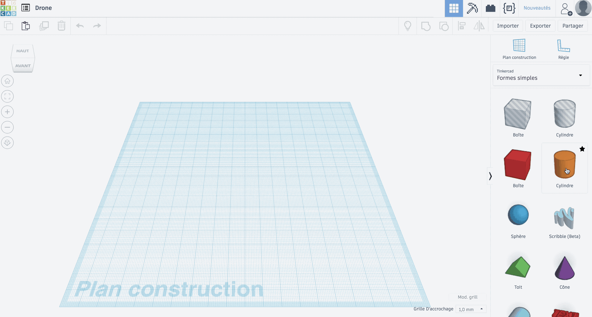

Cliquer sur les rectangles blancs pour donner au cylindre, une base de 10,00 mm en largeur et en profondeur (la hauteur n’a pas besoin d’être modifiée).

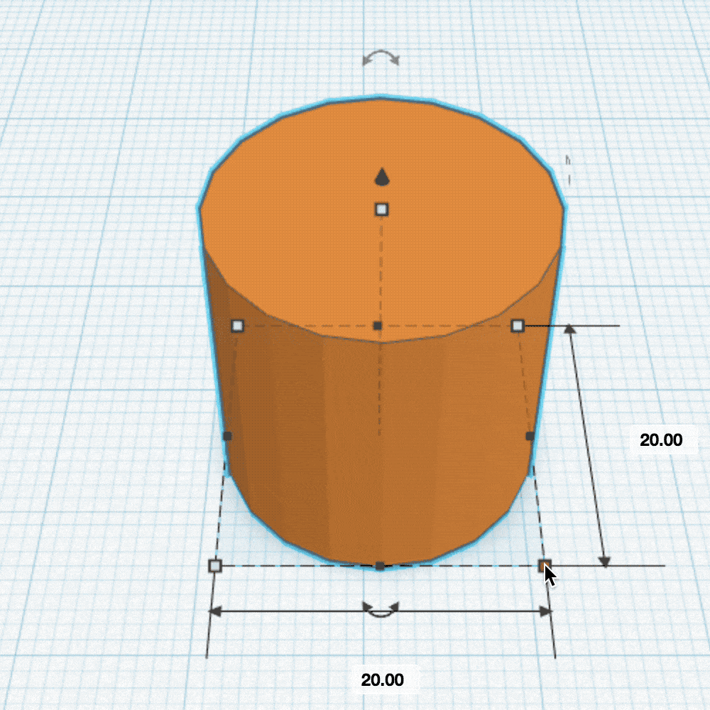

D’autre part, il faut modifier le réglage de la grille en cliquant sur la boîte située en bas à droite et à côté de
« Grille d’accrochage 1,0 mm » et sélectionner 0,25 mm.

Puis, sélectionner le cylindre gris dans le panneau de droite.  Toujours à l’aide des carrés blancs, il faut changer les dimensions de la base du cylindre afin de lui donner les valeurs de 7,50 mm en largeur et 7,50 mm en profondeur.  

À l’aide de la flèche noire au sommet, surélever le cylindre de 2,00 mm en hauteur par rapport au plan de travail.  

## **Étape 2 : Extruder le cylindre orange**

En maintenant le bouton gauche de la souris, sélectionner les deux cylindres.  Ils devraient apparaître tous deux entourés d’un trait couleur cyan.  Appuyer sur le bouton « Aligner » ( ou bien la touche L ).  
Une grille de sélection apparaît sur le rectangle au niveau du plan de travail.  Cliquer sur les cercles se situant au milieu des segments du rectangle.  Le cylindre gris se situe maintenant au milieu du cylindre orange.

Sélectionner ensuite l’icône « Regrouper » en haut à droite ( ou la touche Ctrl + G ).

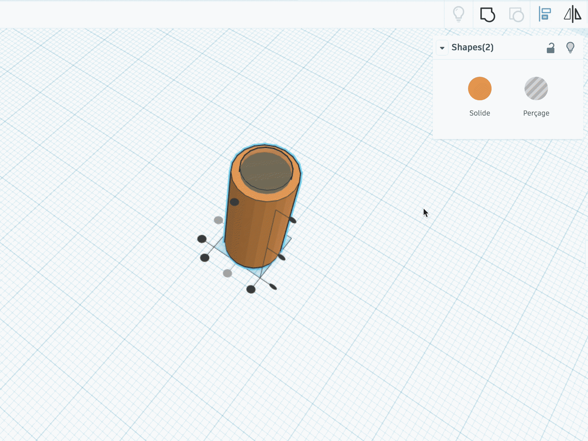

Le cylindre orange est maintenant creux.

## **Étape 3 : Ajouter des aérations**

Il faut donc prendre le cylindre gris du panneau latéral.
Grâce aux doubles flèches courbes, il est nécessaire de lui faire effectuer une rotation de 90°.

Lui donner ensuite une hauteur de 7,00 mm, une largeur de 6,00 mm et une profondeur de 20,00 mm.
Grâce à la flèche noire, le surélever de 1,00 mm.

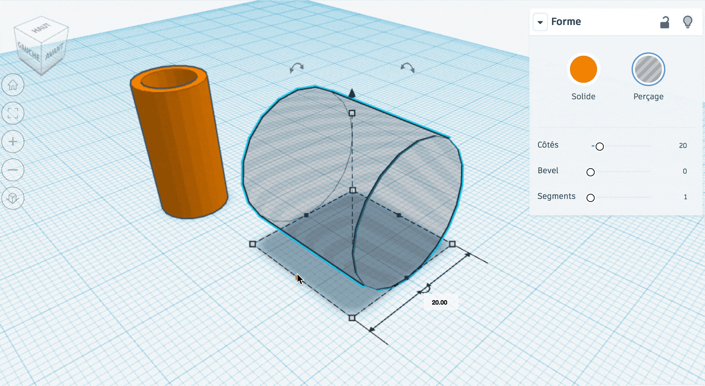

Avec l’outil "Aligner", mettre le cylindre gris au centre du cylindre orange.

Dupliquer le cylindre gris avec le bouton en haut à gauche ( ou bien la touche Ctrl + D ) et grâce à la flèche noire, le surélever de 10,00 mm.

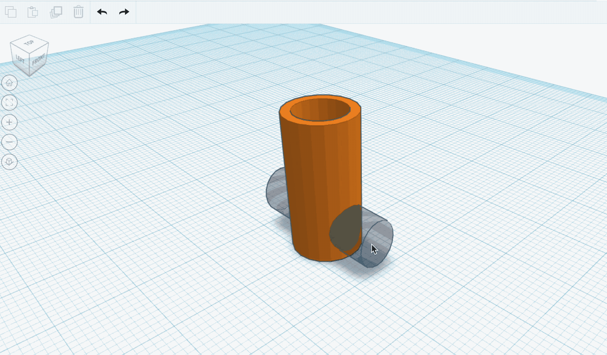

Sélectionner les trois cylindres et cliquer de nouveau sur « Regrouper ».

Le cylindre orange est maintenant percé de quatre ovales.

## **Étape 4 : Réaliser le bras**

Sélectionner la boîte rouge dans le panneau latéral droit.

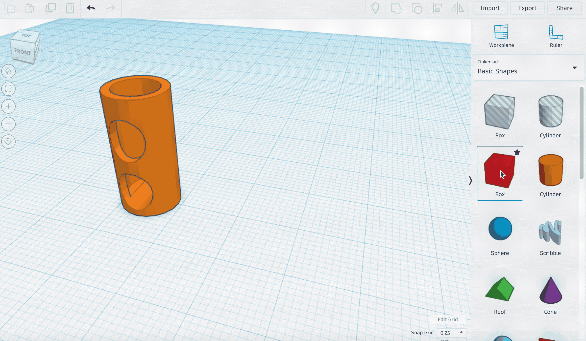

Après avoir placé la boîte rouge sur le plan de travail, il faut lui donner une largeur de 6,50 mm, une hauteur de 6,50 mm et une profondeur de 20,00 mm.

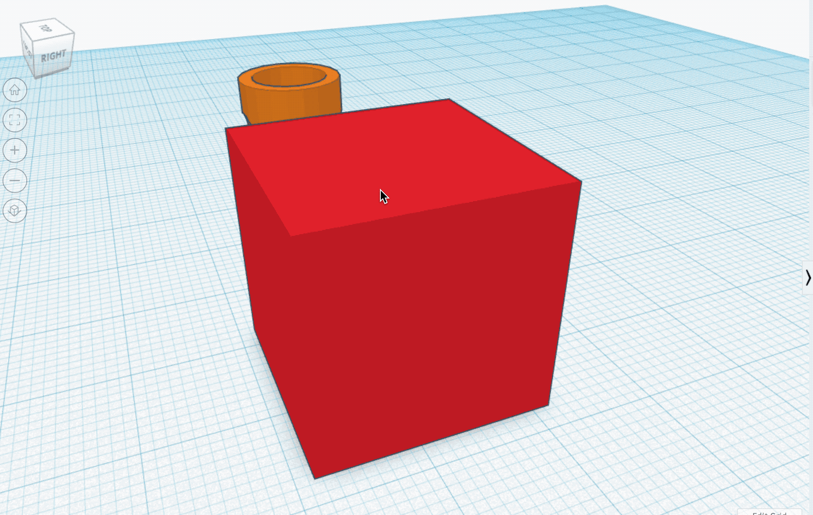

Prendre un cube gris, il est nécessaire de lui donner les dimensions suivantes :
3,25 mm de largeur, 3,25 mm de hauteur et 10,00 mm de profondeur.

Insérer le rectangle gris dans le rectangle rouge en sélectionnant les deux rectangles.  Ensuite, avec l'outil "aligner", centrer le rectangle gris au bord du rectangle rouge en cliquant sur les points noirs situés à mi-hauteur, au milieu et enfin au bord gauche du rectangle rouge.

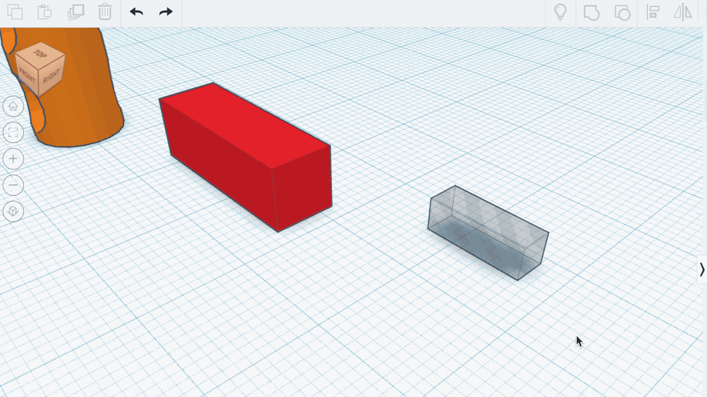

Déplacer vers arrière le rectangle rouge de 1,00 mm sans déplacement latéralement, puis regrouper les deux rectangles.  
(Astuce : Presser la touche ⇧ SHIFT après avoir cliqué avec la souris permet de verrouiller le déplacement dans une seule direction)

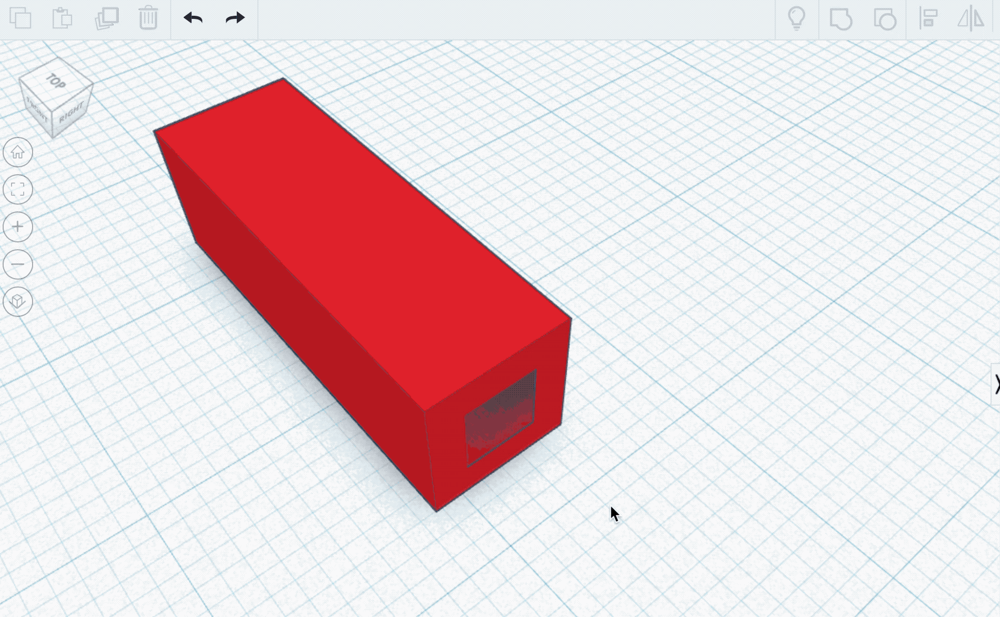

Maintenant, cliquer sur la forme "biseau" et la poser sur le plan de construction. Ensuite, faire effectuer à cette forme une rotation de 90° de sa base vers la gauche et une autre rotation de 90° vers le bas sur son axe vertical.

Donner au biseau une hauteur de 13,50 mm et une largeur de 6,50 mm.

Faire fusionner avec l'outil "aligner" le rectangle et le biseau.

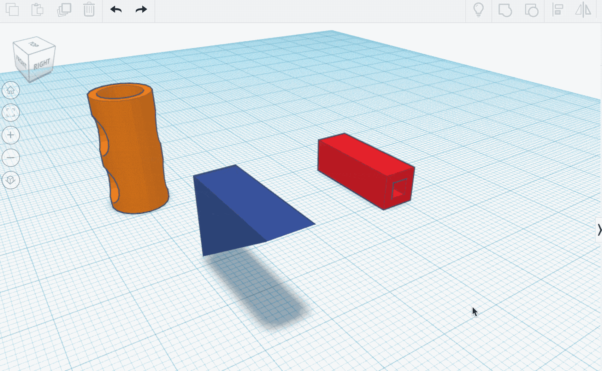

Surélever le rectangle de 13,50 mm pour le poser sur le biseau et regrouper les deux pièces entre elles.

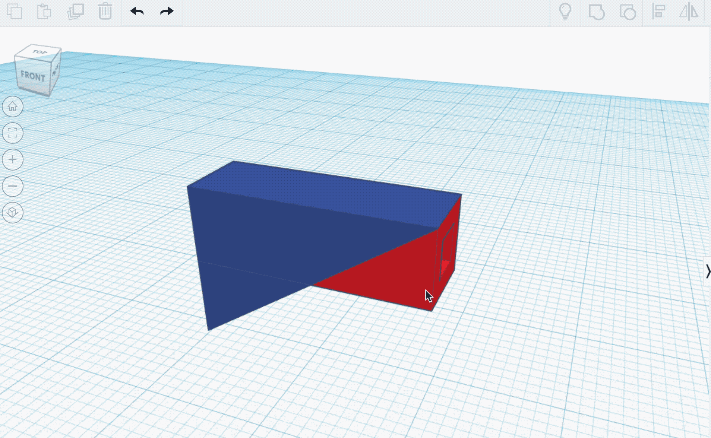

Aligner cette nouvelle pièce avec le cylindre précédemment extrudé.

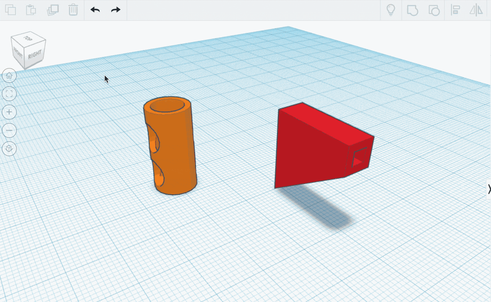

 Déplacer la pièce de 8,25 mm vers la droite et fusionner l'ensemble.

La pièce est maintenant terminée et prête à être imprimée !

