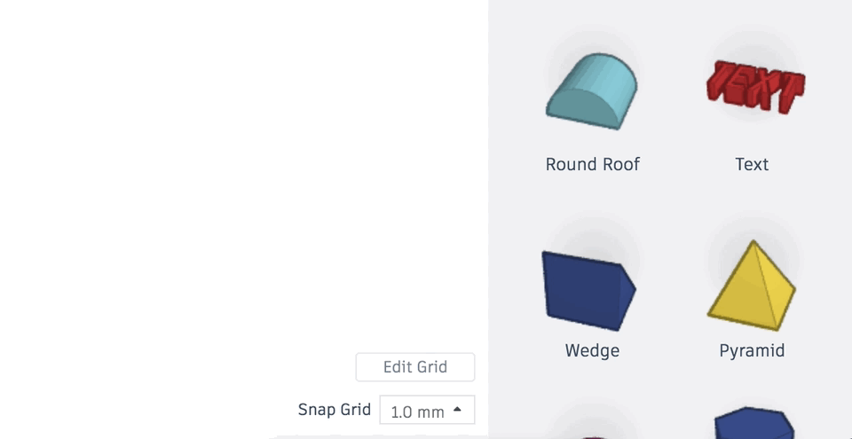

# How to Make the Drone Arm :

Go on the website [Tinkercad](https://www.tinkercad.com/)  
Create an account then select "Create new design" on the Dashboard

## Step 1: Create a cylinder

Drag and drop the orange cylinder from the right side panel onto the workplane.

Use the white squares to change the cylinder diameter size to 10.00 mm (10.00 mm width and 10.00 mm depth).  
The cylinder height does not need to be changed.

Now change the setting of the grid by clicking on the box located at the bottom right of the window.  
Next to "Snap grid 1.0 mm", select 0.25 mm.

Then, select the grey (hollow) cylinder in the right panel.  
Also, again using the white squares, it is necessary to change the cylinder diameter to 7.50 mm width and 7.50 mm depth.

Using the black arrow at the top, move the cylinder 2.00 mm up.

## Step 2: Extrude the orange cylinder

Holding the left mouse button, select both cylinders. They should both appear with a cyan line.  
Press the "Align" button (or the L key).  
A selection grid appears on the rectangle at the level of the workplan, click on the circles located in the middle of the segments of the rectangle.  
The hollow cylinder is now in the middle of the orange cylinder.

Then select the "Group" icon at the top right (or the Ctrl + G key)

The orange cylinder is now hollow.

## Step 3: Add some vents

Therefore, take the hollow cylinder of the side panel.
Thanks to the double curved arrows, rotate it to 90°.

Then, you need to give it a height of 7.00 mm, a width of 6.00 mm and a depth of 20.00 mm.
With the black arrow, move it 1.00 mm up.

With the "align" tool, place the hollow cylinder in the center of the orange cylinder.

Duplicate the hollow cylinder with the button at the top left (or the Ctrl + D key) and with the black arrow, move it 10.00 mm up.

Select the three cylinders and click on "Group" again.

The orange cylinder is now pierced by four ovals.

## Step 4: Make the drone arm

Select the red box in the right side panel.

After having placed it on the workplane, it must be given a width of 6.50 mm, a height of 6.50 mm and a depth of 20.00 mm.

Take a grey cube, it is necessary to give it the following dimensions:
3.25 mm width, 3.25 mm height and 10.00 mm depth.

Insert the hollow rectangle in the red rectangle by selecting the two rectangles.  
With the "align" tool, center the hollow rectangle at the edge of the red rectangle using the black handles.

Move the red rectangle 1.00 mm backward without moving it laterally.  
Group the two rectangles together.  
(ProTip: Pressing the ⇧ SHIFT key after clicking with the mouse locks the movement in one direction )

Now, click on the shape "wedge" and put it on the workplane, then perform on this form a 90° rotation of its base and another rotation of 90° down on its vertical axis.

Give the wedge a height of 13.50 mm and a width of 6.50 mm.

Merge with the tool "align" the rectangle and the wedge.

Move the 13.50 mm rectangle up in order to place it on the bevel and group the two pieces together.

Align this new piece with the previously extruded cylinder.

Move the 8.25 mm piece to the right and merge the set.

Congratulation !
Now you are ready to 3D Print your part !
