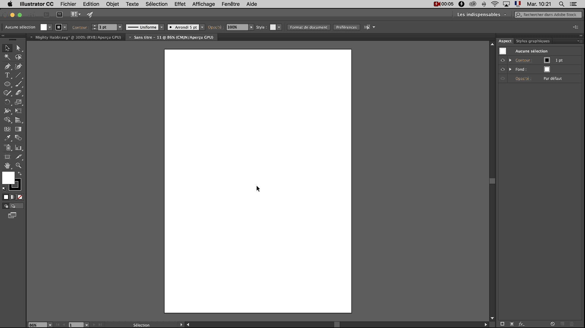
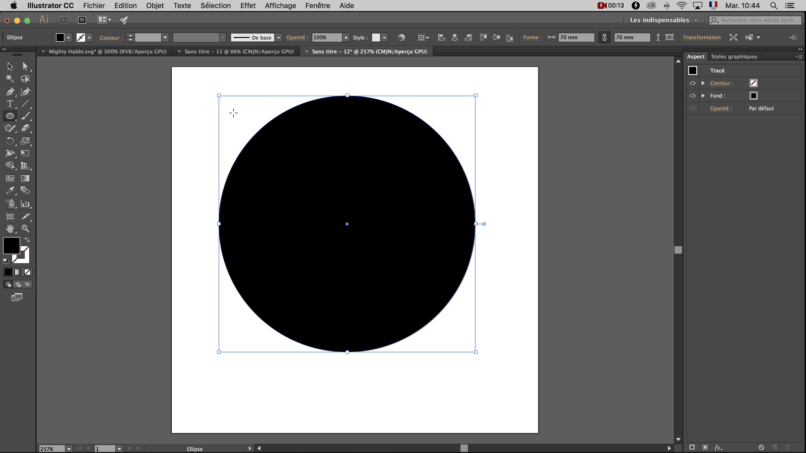
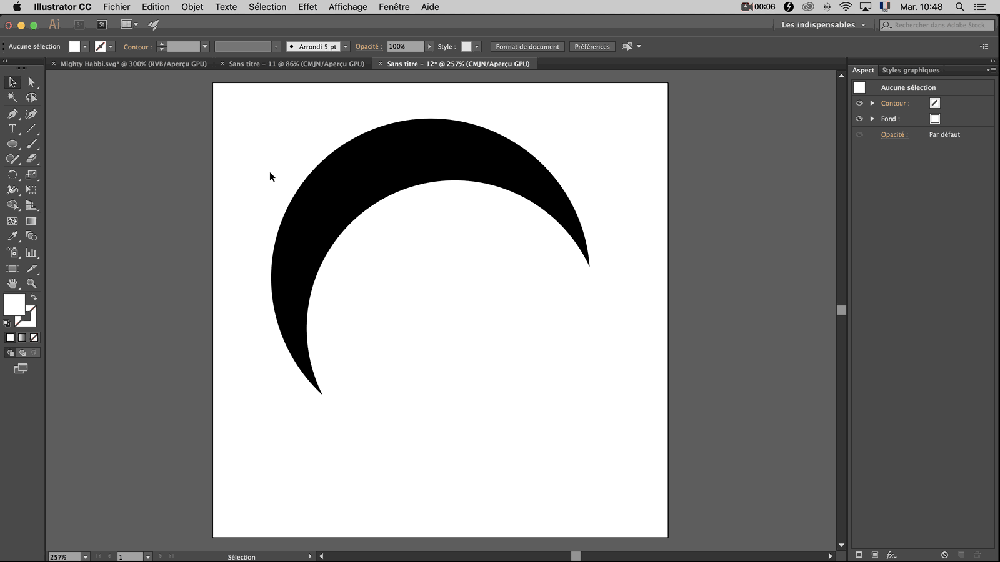
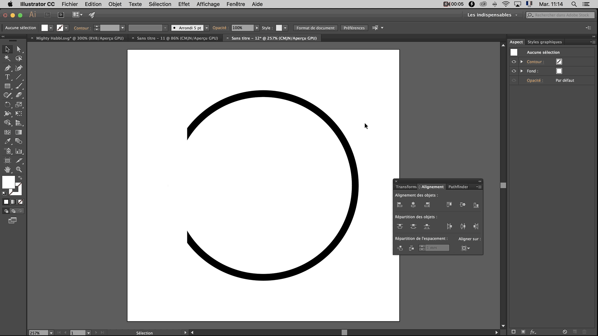
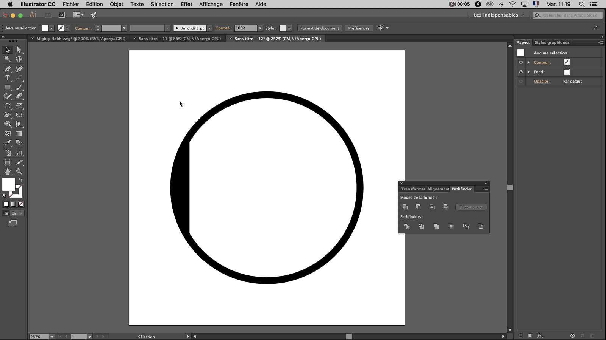

# Pour réaliser les protections des hélices avec Illustrator et Tinkercad :

## Étape 1 : Illustrator

### Ellipses et Alignement

Pour commencer, créer un nouveau plan de travail avec comme dimensions 100mm de largeur par 100mm de hauteur,  
vérifier que les unités sont en Millimètres, dans "Avancées" choisir "Effet de pixellisation" "Élevés 300 ppp" et décocher l'option "Aligner les nouveaux objets sur la grille en pixels "

Sélectionner l'outil "Elipse" dans le panneau latéral de gauche en maintenant le clic de souris sur l'icône "Rectangle".  
Puis dans la fenêtre s'affichant cliquer sur Elipse (ou en appuyant sur la touche L du clavier)  
(Si le "Panneau Outils" n'est pas affiché, aller dans le menu du haut et cliquer sur Fenêtre > Outils > Par défaut)

Faire un simple clic sur la page blanche pour faire apparaitre une boîte de dialogue.  
Dans celle-ci entrer les dimensions 70mm largeur et 70mm hauteur.  
(L'icône à droite des dimensions permet de lier les proportions)

Modidfier l'apparence du cercle grâce aux options en haut à gauche du document.  
À côté de "Ellipse" cliquer sur la première boite et choisir le carré de couleur noir, dans la boite située immédiatement à droite sélectionner le carré barré en rouge cela permet d'obtenir un contour transparent.

En suivant la même méthode, créer un autre cercle de 65 mm par 65 mm.  
Cette fois-ci changer la couleur du cercle en sélectionner le carré de couleur blanc et dans la boite située immédiatement à droite sélectionner le carré barré en rouge.

Cliquer maintenant sur l'outil "Selectionner" dans le panneau latéral de gauche pour pouvoir sélectionner et manipuler la position des cercles librement.  
(Ou en appuyant sur la touche V du clavier)

Afficher le panneau "Aligment des objets" en sélectionnant dans la barre des menus en haut de l'écran,  
"Fenêtre" puis dans le menu déroulant "Alignement"  
(Vous pouvez manipuler librement la position du panneau Aligment au-dessus de votre page)

Nous allons maintenant mettre les deux cercles en surbrillance puis ensuite dans le panneau "Aligment des objets".  
Appuyer sur le bouton "Alignement horizontal au centre " et enfin "Alignement vertical au centre".

Le petit cercle blanc est maintenant au milieu du grand cercle noir.

### Carré, Alignement avancé et Pathfinder

Ajouter ensuite un carré de largeur 7mm et de hauteur 50mm

Aligner le carré avec l'outil "Aligner" au bord à droite du grand cercle noir.  
Pour pouvoir effectuer cette action sans modifier la position des cercles il faut afficher les options supplémentaires d'alignement.  
Il faut pour cela, cliquer sur le bouton en haut à droite dans la fenêtre de l'outil alignement   
Choisir "Afficher les options"
Une rangée d'icônes supplémentaire s'affiche :

Sélectionner en maintenant le clic gauche de la souris, uniquement le grand cercle noir et le rectangle.  
Choisir ensuite en bas à droite de la boite d'Alignement "Aligner sur :" et cliquer sur "Aligner sur un objet clef"  
Mettre en surbrillance le grand cercle noir puis appuyer sur les boutons  
"Alignement horizontal à gauche" puis "Alignement vertical au centre"

Nous allons maintenant utiliser le Pathfinder afin de soustraire le carré au cercle blanc.  
Le Pathfinder est similaire à la fonction "Regrouper" dans Tinkercad.   

Le Pathfinder se situe par défaut juste à côté de "Alignement" dans la boite de dialogue.  
(Dans le cas contraire, faire apparaitre le Pathfinder en sélectionnant dans la barre des menus en haut de l'écran,  
"Fenêtre" puis dans le menu déroulant "Pathfinder")

Mettre en surbrillance le cercle et le rectangle gâce au ⇧ SHIFT + clic puis dans la fenêtre Pathfinder utiliser la fonction "Soustraction"

Le cercle blanc comporte maintenant une indentation à gauche

### Sauvegarde

Enregistrer le document en sélectionnant  Fichier puis Enregistrer sous...

Dans la boîte de dialogue, vous pouvez librement nommer et choisir où enregistrer votre fichier.  
Il faudra néanmoins sélectionner le type de fichier SVG dans le menu déroulant à côté de "Format".  
Puis appuyer sur OK

Une autre boîte de dialogue apparait, laisser le Profil SVG en SVG 1.1 et il n'est pas nécessaire de modifier les autres options. Cliquer sur OK

## Étape 2 : Tinkercad

Importer votre fichier dans Tinkercad grâce au bouton en haut à droite

Dans options d'importation, cliquer sur "Artboard" puis entrer 100mm en Longueur et 100mm en Largeur

Changer la précision de la grille en 0,5mm

Rajouter un cube de 7,00mm de hauteur, 7,00mm de profondeur par 10,00mm de largeur et un cube de perçage de 3,50mm de hauteur par 6,50mm de largeur

Modifier la hauteur de la pièce importée en 2,00mm

Aligner les 3 pièces sur la partie plate du cercle grâce à l'outil "Aligner" comme vu dans le tutoriel précédent.

Prendre le cube de perçage, le rallonger de 3,00mm.
Le surélever de 1,50mm et lui donner une inclinaison de 8º vers l'extérieur.  

Pour pouvoir modifier l'inclinaison degré par degré, il faut après avoir cliquer sur la double flèche, maintenir le clic gauche de la souris enfoncé jusqu'à la roue bleue au-dessus de la pièce.

Sélectionner les trois parties et les regroupées

Exporter la pièce en sélectionnant "Exporter" puis STL pour pouvoir l'imprimer en 3D.

