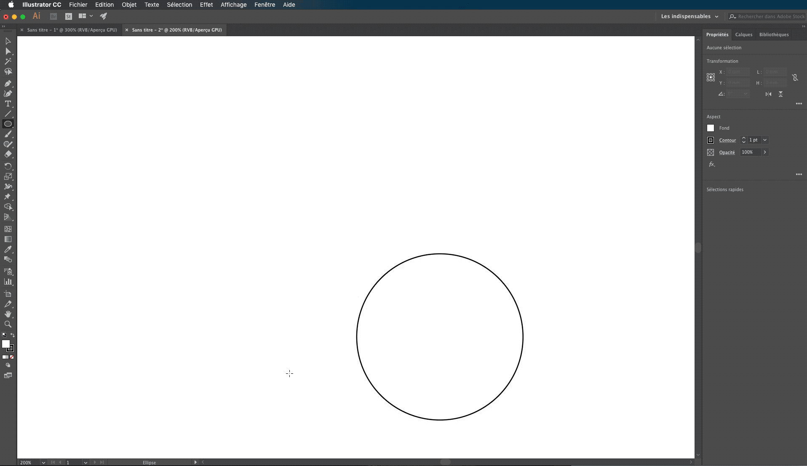

# **Pour réaliser les protections des hélices avec Illustrator et Tinkercad :**

Sélectionner l'outil "Elipse" dans le panneau latéral de gauche en maintenant le clic de souris sur l'icône "Rectangle" puis dans la fenêtre s'affichant cliquer sur Elipse (Ou en appuyant sur la touche L du clavier)
(Si le "Panneau Outils" n'est pas affiché, aller dans le menu du haut et cliquer sur Fênetre > Outils > Par défaut) 

Faire un simple clic au milieu de la page blanche pour faire apparaitre une boîte de dialogue.  
Dans celle-ci entrer les dimensions 70mm largeur et 70mm hauteur.
(L'icône à droite des dimensions permet de lier les proportions)

En suivant la même méthode, créer un autre cercle de 65 mm par 65 mm

Cliquer maintenant sur l'outil "Selectionner" dans le panneau latéral de gauche (Ou en appuyant sur la touche V du clavier) pour pouvoir manipuler la position des cercles

Afficher le panneau "Aligment des objets" en sélectionnant dans la barre des menus en haut de l'écran, "Fenêtre" puis dans le menu déroulant "Alignement"
(Vous pouvez manipuler librement la position du panneau Aligment au-dessus de votre page)

Nous allons maintenant mettre les deux cercles en surbrillance puis ensuite dans le panneau "Aligment des objets", appuyer sur le bouton "Alignement horizontal au centre " et enfin "Alignement vertical au centre"

Le petit cercle est maintenant au milieu du grand cercle

Ajouter ensuite un carré de largeur 7mm et de hauteur 50mm

Aligner le carré avec l'outil "Aligner" au bord à droite du grand cercle, 
Pour pouvoir effectuer cette action sans modifier la position des cercles il faut afficher les options supplémentaires d'alignement.
Il faut pour cela, cliquer sur le bouton en haut à droite dans la fêntre de l'outil alignement ![Alt Text] (Gifs2/Options.svg)

Selectionner en bas à droite "Aligner sur :" et cliquer sur "Aligner sur un objet clef" 
Mettre en surbrillance petit cercle puis appuyer sur les boutons "Alignement horizontal à gauche" puis "Alignement vertical au centre"
