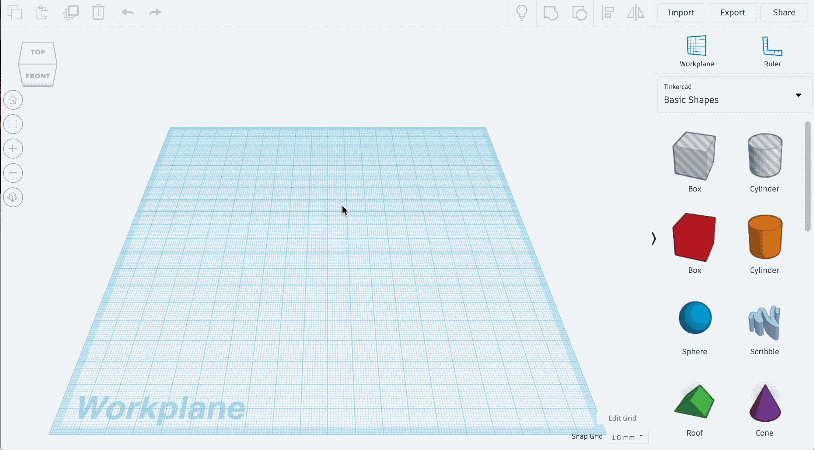
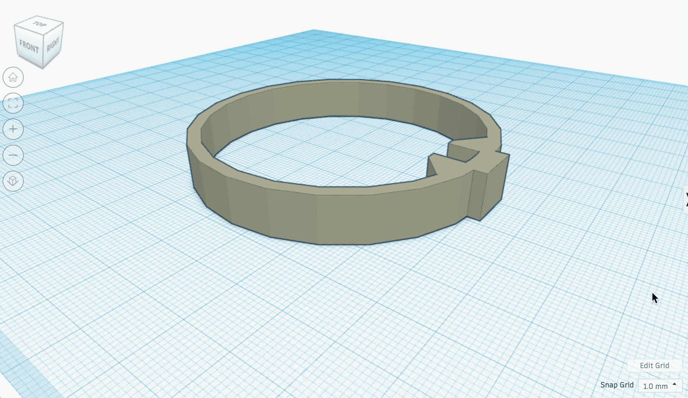

# **Pour réaliser les protections des hélices :**

Télécharger la pièce suivante : [Bumper](Bumper.svg)

Importer là ensuite dans Tinkercad grâce au bouton en haut à droite

Régler l'épaisseur sur 3.00

La précision de la grille doit être réglée sur 0,25mm

Rajouter un cube rouge de 10.50 de largeur, 12 de profondeur et 8.00 de hauteur sur la partie rectangulaire de la pièce précédemment importée.

Puis le percer en son centre grâce à un cube gris de 4.00 de largeur, une profondeur supérieure à 6.00 et 3.25 de hauteur

Avec un autre cube gris de 6.50 de largeur et 7.00 de profondeur, réaliser une ouverture entre les deux triangles.
