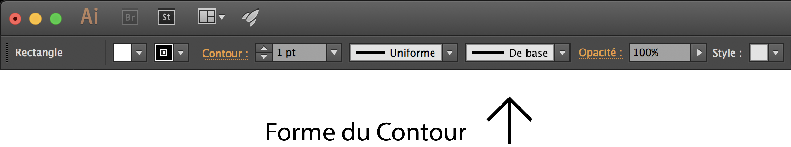
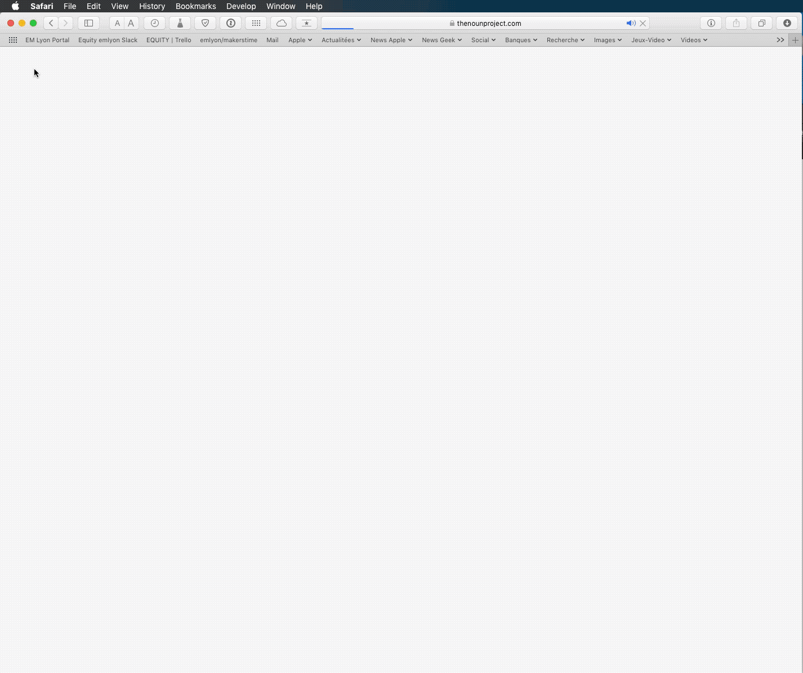
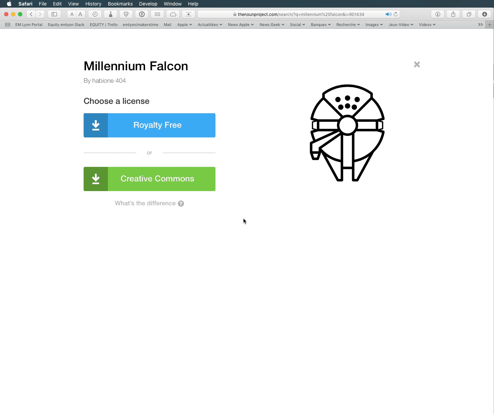
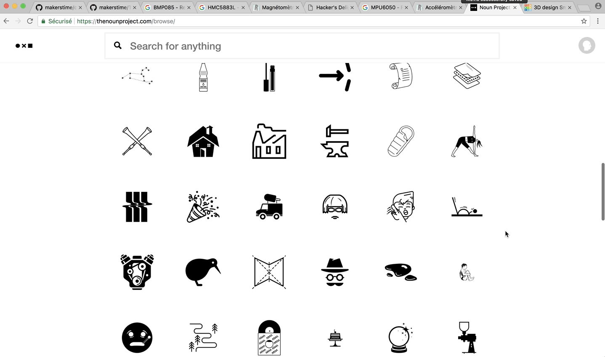
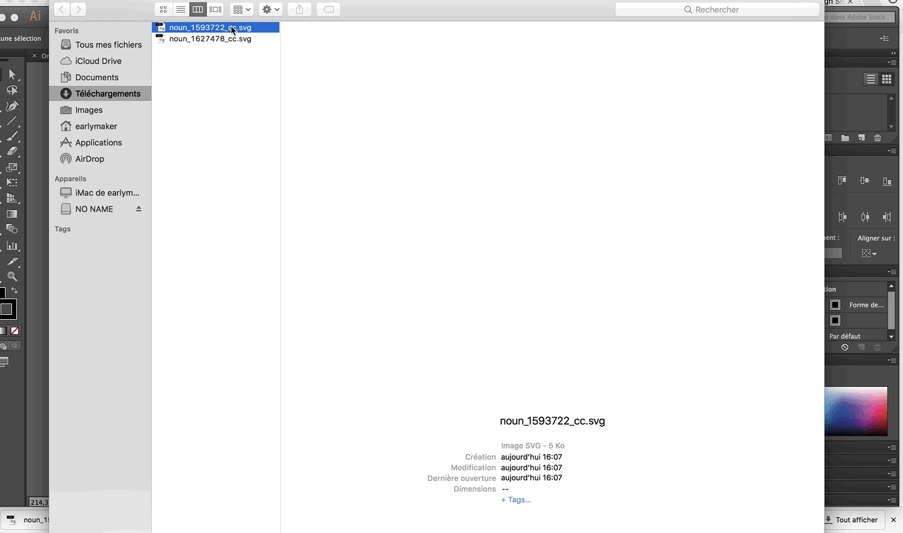
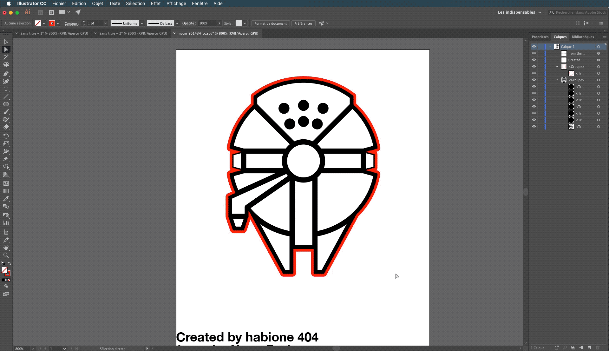

# Pour Personnaliser son Drone:

## Changer le design des Protections :

Dans Illustrator, reprendre le dessin de la protection

Nous allons utiliser l'outil "Options de forme de motif"

Pour cela, créer une forme sur la page à côté de la protection et sélectionnée là

Maintenant, cliquer sur la boite "Forme du contour" en haut de votre page elle devrait par défaut contenir un trait noir avec mentionné "De base" à côté

Cliquer sur l'icône "Nouvelle forme" puis dans la boite de dialogue "Forme de motif"

La boite de dialogue "Options de forme de motif" apparaît.

Vous pouvez modifier le pas et l'échelle de la forme puis appuyer sur OK

Sélectionnez le cercle noir et toujours dans le menu Forme de contour" sélectionner votre forme précédemment crée

Vous pouvez de nouveau modifier les réglages du contour dans "Options de l'objet sélectionné"

Exportez votre dessin en SVG et importez-le dans Tinkercad comme vu dans le Tutoriel 2

## Ajouter des décorations avec la découpe laser :

Aller sur le site the [Noun Project](https://thenounproject.com)

Grâce à ce site, vous pouvez très facilement et gratuitement téléchargez des images dans un format vectorisé

Sélectionner une image sur le site puis cliquer sur "Download" et "SVG" puis "Creative Commons"

(Si demandé, créer un compte gratuit sur le site)

Maintenant, importer votre image vectorisée dans Illustrator

Comme vu précédemment dans la Makers' ToolboxPour pour découper une forme au laser, nous avons besoin de créer un contour rouge. 

Dans un premier temps, nous allons afficher le panneau calques grâce au menu "Fenêtre" puis "Calques", cela nous permettra d'isoler le contour de la forme que nous allons créer. 

Sélectionner ensuite la forme puis aller dans le menu "Objet" > "Tracé" > "Décalage".  
Choisir 0,1 mm et cliquer sur OK  
Sélectionner le calque avec le contour précédemment créer, sélectionner sans remplissage puis contour rouge avec une épaisseur de 0,001mm.
Masquer les autres calques avec le bouton en forme d'oeil puis avec "Outil Sélection direct", effacer les traits rouges à l'intérieur de l'image

## Pour créer un chapeau

La taille maximale recommandée pour un chapeau est de 40mm de largeur par 40mm de profondeur pour ne pas obstruer les passages d'hélices et un poids maximal de 5 grammes. Un drone lourd est plus facile à piloter au détriment de la durée de vol.

Pour créer un des trous de vis afin de fixer le chapeau, ajouter deux ronds rouges de 2 mm par 2 mm et définir une distance de 24 mm entre l'un et l'autre.
Pour cela, utilisez le panneau "Aligner", la fonction "Aligner sur un objet clef" puis le bouton "Distribution verticale de l'espace".  

Le fichier peut maintenant être enregistré en SVG ou en AI pour pouvoir l'exporter.

N'hésitez pas à combiner différents matériaux entre eux comme du bois et du papier Canson

## Pour créer un autocollant

Prendre une image sur the Noun Project 

Dans l'ordinateur à côté de la découpe laser ouvrer votre fichier avec Illustrator et sélectionner dans "Fichier" > "Envoyer vers Cutting Master 3"

Si besoin le logiciel peut être téléchargé sur votre ordinateur si vous disposez déjà d'Illustrator CC :

[Cutting Master 3](http://ankersmit.fr/telechargement_decoupe_ce5000.html)

Il suffit ensuite de branche la machine en USB sur l'ordinateur 

# Makers' Toolbox

[Intro to laser cutting](https://youtu.be/T_0pDgfpme8?list=PL_t1-MryummxwZb7xBvnf4TLlFhXNdn7D)

[Intro to 3d printing](https://youtu.be/FzPWmxMxMAc?list=PL_t1-MryummxwZb7xBvnf4TLlFhXNdn7D)
